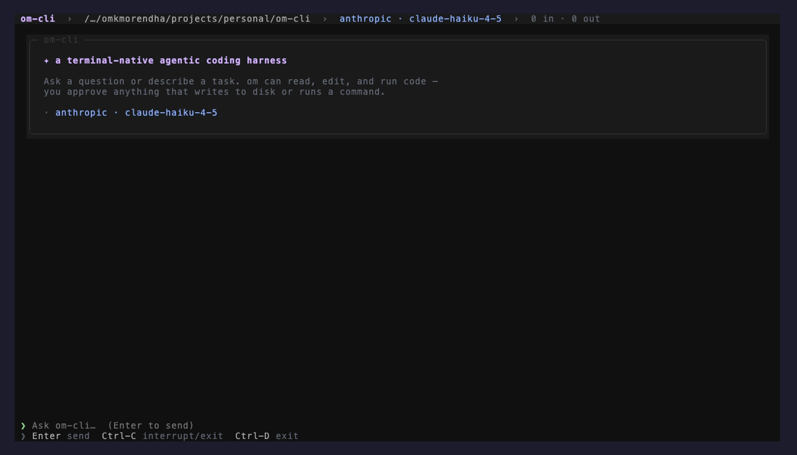
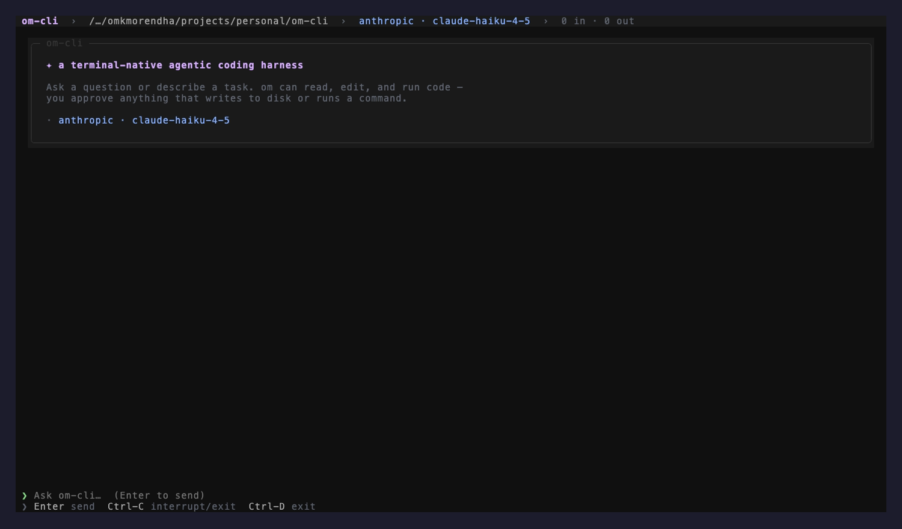
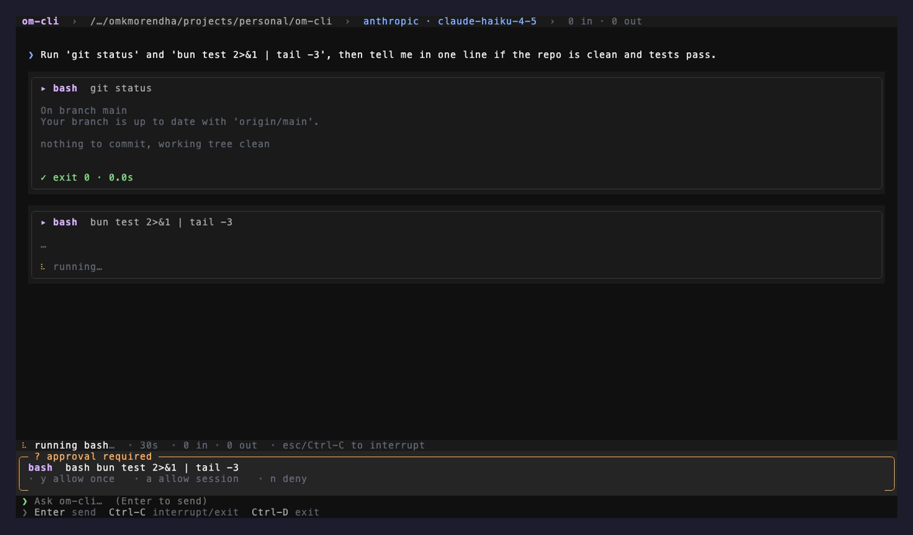
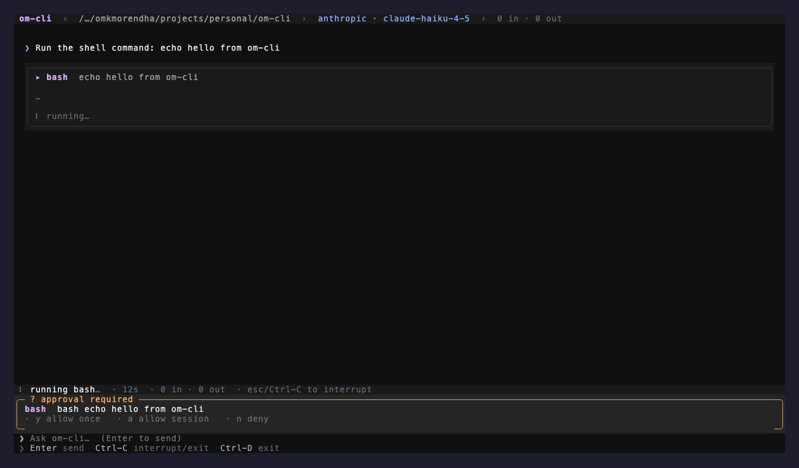
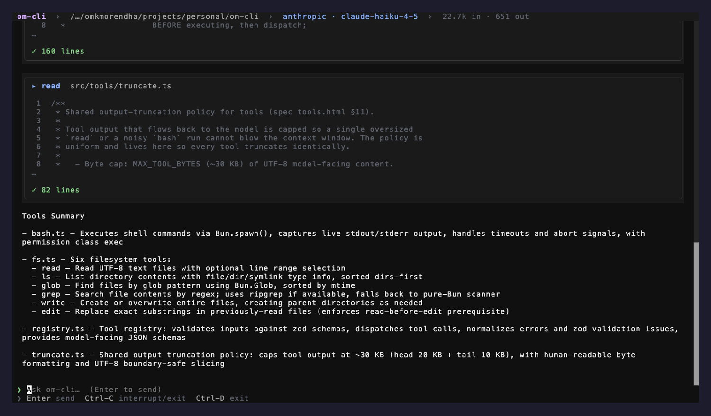

# om-cli

A terminal-native **agentic coding harness** — in the spirit of Claude Code / Codex. An
LLM drives a loop, calls tools to read and modify the local filesystem and run commands,
and a TUI renders the conversation, tool activity, and approvals.

> **Status: v0 feature-complete.** Core (agent loop, providers, tools, permissions, sessions),
> the rich OpenTUI frontend + headless fallback, and the entry point are all implemented and
> tested (305 tests, `tsc` clean). What's left is a hands-on pass of the live TUI in a real
> terminal. See [Status](#status) below.

**Stack:** [Bun](https://bun.sh) · TypeScript (strict) · [OpenTUI](https://github.com/sst/opentui) ·
[zod](https://zod.dev) 4 · Anthropic Messages API + OpenAI Responses API.

---

## The TUI

The rich OpenTUI frontend renders the whole agent loop in your terminal: a header with
provider/model and a live token counter, the assistant's reply as rendered markdown, each tool
call as its own card (with live `bash` output and exit status), and an approval bar before
anything touches disk or runs a command.



<table>
  <tr>
    <td width="50%" valign="top">
      <br/>
      <sub><b>Welcome screen</b> — header (path · provider · model · token counter), the prompt, and the footer keybind hints.</sub>
    </td>
    <td width="50%" valign="top">
      <br/>
      <sub><b>Tool cards</b> — a finished <code>bash</code> call with output and a green <code>✓ exit 0</code>, plus another still streaming.</sub>
    </td>
  </tr>
  <tr>
    <td width="50%" valign="top">
      <br/>
      <sub><b>Approval gate</b> — writes and commands pause for <code>y</code> allow once · <code>a</code> allow session · <code>n</code> deny.</sub>
    </td>
    <td width="50%" valign="top">
      <br/>
      <sub><b>Markdown replies</b> — the assistant's answer renders as markdown (lists, emphasis, code) right in the scrollback.</sub>
    </td>
  </tr>
</table>

> Captured live against `claude-haiku-4-5` via the Anthropic Messages API.

---

## Why

A small, legible harness you can actually read end-to-end. The design bias is:

- **Provider-agnostic core** — the agent loop is written once; Anthropic and OpenAI sit behind
  one `Provider` interface, and the session stores messages in a single canonical format.
- **Tools are the only side-effect surface** — the model never touches disk directly. Every
  effect flows through a registered, zod-validated tool that passes the permission gate.
- **Streaming-first, stop-anywhere** — text and tool events stream to the frontend as they
  arrive; an `AbortSignal` threads through the provider stream and `Bun.spawn` for clean Ctrl-C.

## Specification (source of truth)

The [`spec/`](./spec) folder is the authoritative design wiki — when code and spec disagree,
the spec wins or the spec gets updated. Open [`spec/index.html`](./spec/index.html) in a browser,
or read the pages directly:

| Page | What it covers |
|------|----------------|
| [`spec/v0.html`](./spec/v0.html) | The core spec: architecture, agent loop, providers, tools, permissions, sessions, TUI, milestones, decisions. |
| [`spec/providers.html`](./spec/providers.html) | Anthropic / OpenAI Responses adapters — wire-format mappings, streaming parse, cancellation. |
| [`spec/tools.html`](./spec/tools.html) | Per-tool contracts: zod schemas, result shapes, truncation policy, the exact-string edit algorithm. |
| [`spec/tui.html`](./spec/tui.html) | OpenTUI component tree, event wiring, keybindings. |
| [`spec/roadmap.html`](./spec/roadmap.html) | Post-v0 features (MCP, sub-agents, compaction, diff UI…). |
| [`spec/decisions.html`](./spec/decisions.html) | ADR-style decision log. |

Conventions for the codebase and the spec wiki live in [`CLAUDE.md`](./CLAUDE.md).

## Architecture

One Bun process. A UI-agnostic **core** emits a typed `AgentEvent` async-iterable; a
**frontend** (TUI, or a headless stdout fallback) consumes it and produces user input.

```
┌──────────────────────────────────────────────┐
│  Frontend (OpenTUI / headless stdout)          │
│  input · scrollback · tool cards · approvals   │
└───────────────▲────────────────────┬───────────┘
       input    │            events  │  (text / tool / approval)
┌───────────────┴────────────────────▼───────────┐
│  Core                                            │
│   Agent Loop ─▶ Provider (Anthropic / OpenAI)    │
│        │        Session + JSONL transcript       │
│        ▼                                          │
│   Tool Registry ─▶ Permission Gate ─▶ Effects     │
│   (read/ls/glob/grep/write/edit/bash)             │
└──────────────────────────────────────────────────┘
```

## Getting started

Requires **Bun ≥ 1.3**.

```bash
bun install

# API keys (read from env only — never written to config or transcripts)
cp .env.example .env        # then fill in ANTHROPIC_API_KEY / OPENAI_API_KEY

bun run typecheck           # tsc --noEmit
bun test                    # bun:test suite
bun run om --help           # flags + env vars
```

### Running the TUI

The rich OpenTUI frontend (markdown replies, per-tool cards, live status bar) needs a real
terminal (a TTY). Run it directly in your terminal — not through a pipe, an IDE “run” pane that
captures stdout, or CI:

```bash
bun run om --tui            # force the OpenTUI frontend (requires a TTY)
bun run om                  # auto: TUI when stdout is a TTY, else headless stdout
bun run om --headless       # force the plain stdout frontend (pipes, CI, debugging)
```

Once it's up:

- **Type a message** and press **Enter** to send. The assistant’s reply streams in as rendered
  markdown; each tool call appears as its own card with a live spinner, and `bash` output streams
  into its card as it runs.
- **Approvals**: when a tool wants to write to disk or run a command, an approval bar appears —
  press **`y`** (allow once), **`a`** (allow for the rest of the session), or **`n`** (deny). You
  can also pick with the arrow keys + Enter.
- **Interrupt / exit**: **Ctrl-C** aborts the in-flight turn; at an idle, empty prompt a second
  Ctrl-C (or **Ctrl-D**) exits. The footer always shows these hints.

You’ll need a provider API key in the environment first (`ANTHROPIC_API_KEY` or `OPENAI_API_KEY`,
e.g. via `.env` above). The provider/model and a running token count are shown in the header.

> If the terminal can’t initialize the renderer, om falls back to the headless stdout frontend
> automatically — so a non-TTY environment degrades gracefully rather than crashing. Code-block
> syntax highlighting additionally requires the optional `web-tree-sitter` peer; without it,
> markdown still renders, just with unhighlighted code.

Configuration is merged from built-in defaults → `~/.om/config.json` → `./.om/config.json`
→ env/flags. Example project config:

```jsonc
// .om/config.json
{
  "provider": "anthropic",          // or "openai"
  "model": "claude-opus-4-8",
  "permissions": {
    "autoAllow": ["read"],
    "allowCommands": ["bun test", "git status"]
  }
}
```

## Layout

```
om-cli/
├── CLAUDE.md            # codebase + spec conventions
├── spec/                # source-of-truth design wiki (HTML)
├── src/
│   ├── core/            # types, session, prompt, agent loop, events
│   ├── providers/       # anthropic.ts, openai.ts (canonical ⇄ wire adapters)
│   ├── tools/           # fs (read/ls/glob/grep/write/edit), bash, registry, truncate
│   ├── permission/      # approval gate
│   ├── tui/             # rich OpenTUI frontend (tui.ts) · headless stdout (stdout.ts)
│   │                    #   · theme.ts · frontend.ts (shared, testable render helpers)
│   ├── util/            # structured JSONL logger
│   └── config.ts        # config resolution
└── test co-located as *.test.ts next to each module
```

## Tooling & debugging

- **Logging** — a structured JSONL logger writes to `.om/logs/<session>.jsonl` (full fidelity,
  always on) with scoped child loggers and secret redaction. Set `OM_LOG_LEVEL=debug` (or use
  `bun run dev`) to also stream logs to stderr. Logs never go to stdout, so they can't corrupt
  the TUI.
- **Transcripts** — every session appends a replayable JSONL transcript to `.om/transcripts/`.
- **Tests** — `bun test`. Provider adapters are tested as pure serialize/parse functions against
  synthetic SDK events (no network, no keys required).

## Status

v0 milestones (see [`spec/v0.html` §12](./spec/v0.html)):

- [x] Scaffold, strict TS, structured logging
- [x] Canonical types + session + JSONL transcript
- [x] Tools: read · ls · glob · grep · write · edit (exact-string) · bash
- [x] Permission gate (auto-allow / prompt / session-allowlist)
- [x] Anthropic (Messages) + OpenAI (Responses) provider adapters
- [x] Agent loop (streaming, sequential tools, abort, turn cap)
- [x] Rich OpenTUI frontend (markdown replies · per-tool cards + diffs · live status bar ·
      animated spinners · live bash output) + headless stdout fallback + `main.ts` wiring
- [x] `tsc --noEmit` clean · `bun test` green (305 tests)

**v0 is feature-complete.** The rich TUI renders correctly against OpenTUI's headless test
renderer (proving the runtime accepts the full renderable tree); a final hands-on pass in a
real terminal — live streaming cadence, Ctrl-C abort feel — is the only thing CI can't cover.

## License

MIT — see [LICENSE](./LICENSE).
